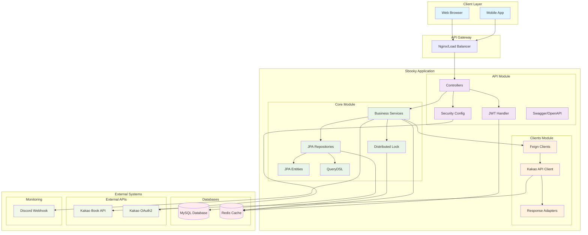
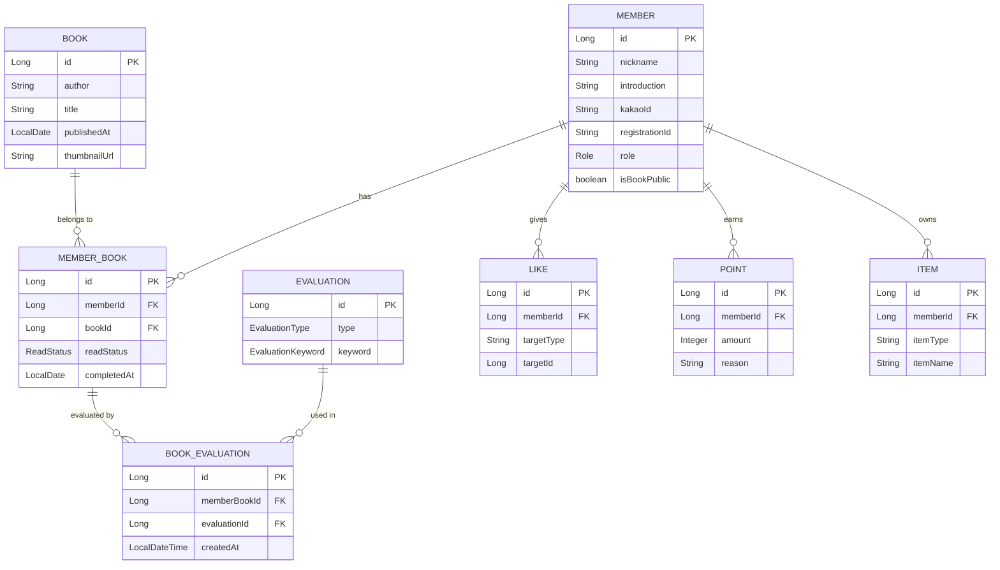
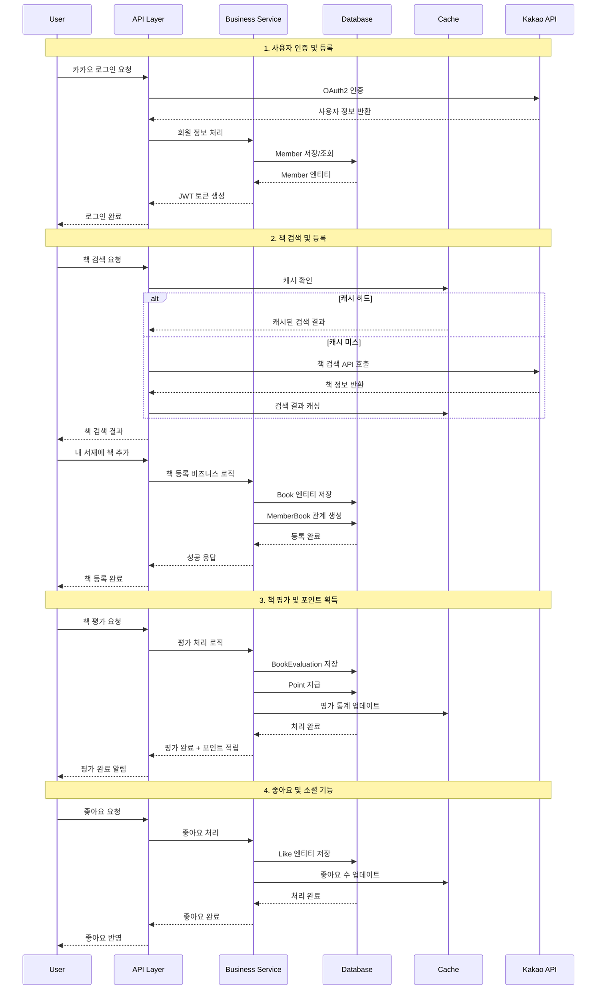
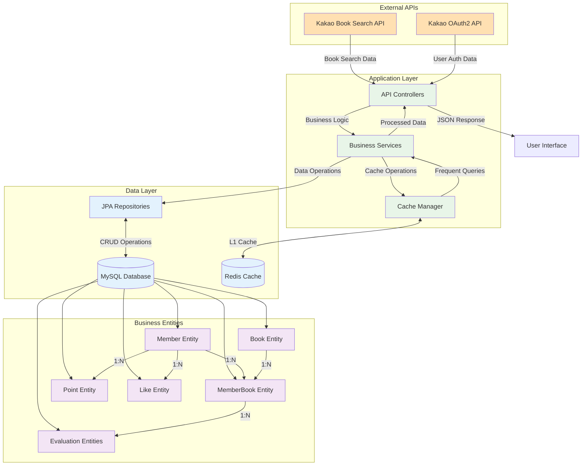

# Sbooky 시스템 아키텍처

## 1. 전체 시스템 개요

Sbooky는 Spring Boot 기반의 모듈형 멀티 프로젝트로 구성된 게이미피케이션 요소가 추가된 독서 기록 시스템입니다.   
마이크로서비스 아키텍처의 장점을 활용하여 관심사의 분리와 모듈간 의존성을 명확하게 관리하는 구조로 설계되었습니다.

## 2. 모듈별 구조 분석

### 2.1 API 모듈 (api)
- **역할**: REST API 엔드포인트 제공, 웹 계층 담당
- **주요 기능**:
  - HTTP 요청/응답 처리
  - 인증/인가 (OAuth2, JWT)
  - API 문서화 (OpenAPI/Swagger)
  - 보안 설정
  - 비즈니스 로직 호출
- **주요 패키지**:
  - `book/`: 책 관련 API
  - `evaluation/`: 평가 관련 API
  - `member/`: 회원 관리 API
  - `security/`: 인증/보안 설정
  - `config/`: 설정 클래스들

### 2.2 Core 모듈 (core)
- **역할**: 비즈니스 로직, 데이터 액세스 계층
- **주요 기능**:
  - JPA 엔티티 정의
  - 비즈니스 로직 구현
  - 데이터베이스 연동 (MySQL)
  - 캐시 관리 (Redis)
  - 분산 락 처리
  - QueryDSL을 통한 동적 쿼리
- **주요 구성요소**:
  - Entity 클래스들
  - Repository 인터페이스
  - Service 클래스들
  - Redis 캐시 설정

### 2.3 Clients 모듈 (clients)
- **역할**: 외부 API 연동
- **주요 기능**:
  - Kakao Book Search API 연동
  - OpenFeign 기반 HTTP 클라이언트
  - 외부 API 응답 모델 정의
- **주요 구성요소**:
  - `KakaoApiClient`: Feign Client 인터페이스
  - `KakaoBookAdapter`: API 응답 변환
  - Feign 설정 클래스

## 3. 외부 시스템 연동

### 3.1 데이터베이스 (MySQL)
- **용도**: 주요 비즈니스 데이터 저장
- **연결**: Spring Data JPA + QueryDSL
- **설정**: 환경별 데이터베이스 설정 분리

### 3.2 캐시 시스템 (Redis)
- **용도**: 
  - 세션 저장
  - API 응답 캐싱
  - 분산 락 구현
  - 레이트 리미팅 (Bucket4j)
- **연결**: Spring Data Redis + Lettuce

### 3.3 외부 API
- **Kakao Book Search API**: 책 정보 검색
- **Kakao OAuth2**: 소셜 로그인

### 3.4 기타 외부 연동
- **Discord**: 로그 알림 (Logback Discord Appender)
- **JWT**: 인증 토큰 관리

## 4. 시스템 흐름 분석

### 4.1 사용자 인증 흐름
1. 사용자가 카카오 로그인 요청
2. API 모듈에서 카카오 OAuth2 인증 처리
3. 인증 성공 시 JWT 토큰 생성 및 반환
4. 이후 API 요청 시 JWT 토큰을 통한 인증 확인

### 4.2 책 검색 및 조회 흐름
1. 클라이언트에서 책 검색 API 호출
2. API 모듈에서 요청 수신 및 검증
3. Core 모듈의 비즈니스 로직 실행
4. Clients 모듈을 통한 카카오 API 호출
5. 결과 데이터 가공 및 응답 반환
6. 필요시 Redis 캐싱 적용

## 5. 아키텍처 다이어그램

## 6. 주요 기술 스택

### Backend
- **Framework**: Spring Boot 3.x
- **Security**: Spring Security + OAuth2 + JWT
- **Data Access**: Spring Data JPA + QueryDSL
- **Cache**: Spring Data Redis + Caffeine
- **HTTP Client**: OpenFeign
- **Rate Limiting**: Bucket4j
- **Documentation**: OpenAPI 3 (Swagger)

### Database
- **Primary**: MySQL
- **Cache**: Redis

### External Integration
- **Book Search**: Kakao Daum Book Search API
- **Authentication**: Kakao OAuth2
- **Monitoring**: Discord Webhook

### DevOps
- **Build**: Gradle
- **Container**: Docker
- **Deployment**: Multi-profile support (local/dev/prod)

## 7. 설계 원칙 및 특징

### 7.1 모듈 분리
- **관심사의 분리**: API, 비즈니스 로직, 외부 연동을 명확히 분리
- **의존성 방향**: API → Core ← Clients (단방향 의존성)
- **재사용성**: Core 모듈의 비즈니스 로직을 다른 API에서도 활용 가능

### 7.2 확장성
- **수평 확장**: 무상태(Stateless) API 설계
- **캐시 전략**: Redis를 활용한 성능 최적화
- **비동기 처리**: 필요시 비동기 처리 지원

### 7.3 안정성
- **분산 락**: Redis 기반 동시성 제어
- **레이트 리미팅**: API 호출량 제한
- **에러 처리**: 체계적인 예외 처리 및 로깅
- **모니터링**: Discord를 통한 실시간 알림

이 아키텍처는 확장 가능하고 유지보수가 용이한 구조로 설계되어 있으며, 각 모듈의 책임이 명확히 분리되어 있어 팀 단위 개발에도 적합한 구조입니다.

## 9. 비즈니스 도메인 UML 다이어그램

### 9.1 도메인 모델 다이어그램

### 9.2 비즈니스 프로세스 흐름도

### 9.3 데이터 플로우 다이어그램

### 9.4 주요 비즈니스 플로우 설명

#### 📚 책 관리 플로우
1. **책 검색**: 사용자 요청 → 캐시 확인 → 카카오 API 호출 → 결과 캐싱
2. **책 등록**: Book 엔티티 생성 → MemberBook 관계 설정 → 읽기 상태 관리
3. **독서 진행**: ReadStatus 업데이트 → 완독 시 평가 가능 상태 전환

#### ⭐ 평가 시스템 플로우
1. **평가 생성**: MemberBook 기반 → BookEvaluation 생성 → 키워드/타입 설정
2. **포인트 적립**: 평가 완료 → Point 엔티티 생성 → 게이미피케이션 요소 적용
3. **통계 집계**: Redis 캐시 활용 → 실시간 평가 통계 업데이트

#### 👥 소셜 기능 플로우
1. **좋아요**: Like 엔티티 생성 → 대상(책/평가) 연결 → 캐시 업데이트
2. **공개 설정**: Member.isBookPublic 플래그 → 서재 공개 여부 제어
3. **아이템 시스템**: Point 소모 → Item 획득 → 게이미피케이션 강화

이 UML 다이어그램들은 Sbooky 시스템의 비즈니스 도메인 간 관계와 데이터 흐름을 명확하게 보여주며, 게이미피케이션이 적용된 독서 기록 서비스의 핵심 비즈니스 로직을 시각화합니다.
