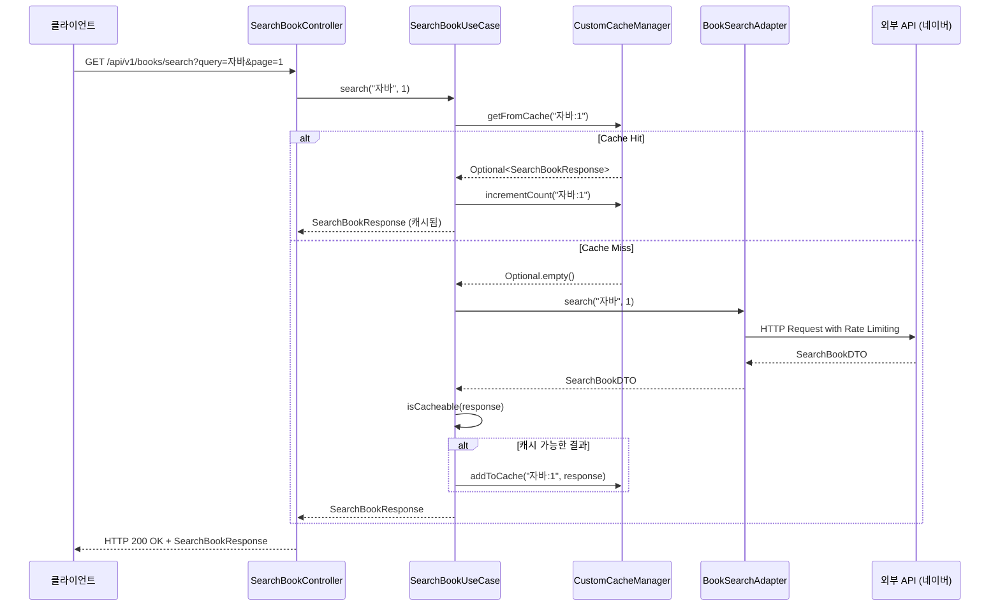
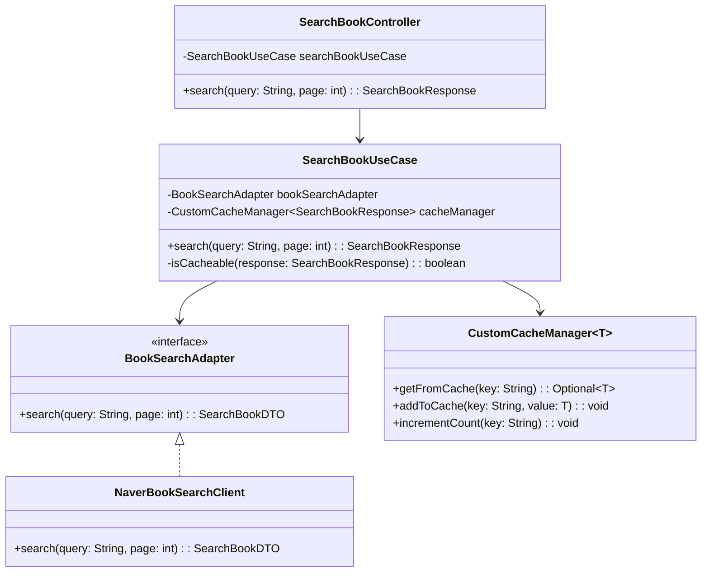

# 도서 검색 시스템 아키텍처

## 시스템 구조도 (UML Sequence Diagram)

## 클래스 다이어그램

## 핵심 설계 원칙

### 1. 의존성 역전 원칙 (DIP)
- `SearchBookUseCase`는 구체적인 구현체가 아닌 `BookSearchAdapter` 인터페이스에 의존
- 외부 API 변경 시 비즈니스 로직 수정 없이 구현체만 교체 가능

### 2. 단일 책임 원칙 (SRP)
- `SearchBookUseCase`: 도서 검색 비즈니스 로직만 담당
- `CustomCacheManager`: 캐싱 로직만 담당
- `BookSearchAdapter`: 외부 API 연동만 담당

### 3. 개방-폐쇄 원칙 (OCP)
- 새로운 도서 검색 API 추가 시 기존 코드 수정 없이 새로운 구현체만 추가
- 캐싱 전략 변경 시에도 UseCase 코드는 변경되지 않음

## 데이터 흐름

1. **요청 수신**: Controller가 검색 요청을 받음
2. **캐시 확인**: UseCase가 캐시에서 데이터 조회 시도
3. **캐시 히트**: 캐시된 데이터가 있으면 조회수 증가 후 즉시 반환
4. **캐시 미스**: 캐시에 없으면 외부 API 호출
5. **결과 처리**: 응답 데이터를 캐시 가능 여부 판단 후 선별적 캐싱
6. **응답 반환**: 최종 결과를 클라이언트에게 전달

## 성능 최적화 요소

- **선별적 캐싱**: 빈 결과는 캐싱하지 않아 메모리 효율성 향상
- **검색 빈도 기반**: 자주 검색되는 키워드만 캐싱하여 히트율 극대화
- **Rate Limiting**: 토큰 버킷 알고리즘으로 외부 API 호출량 제어
