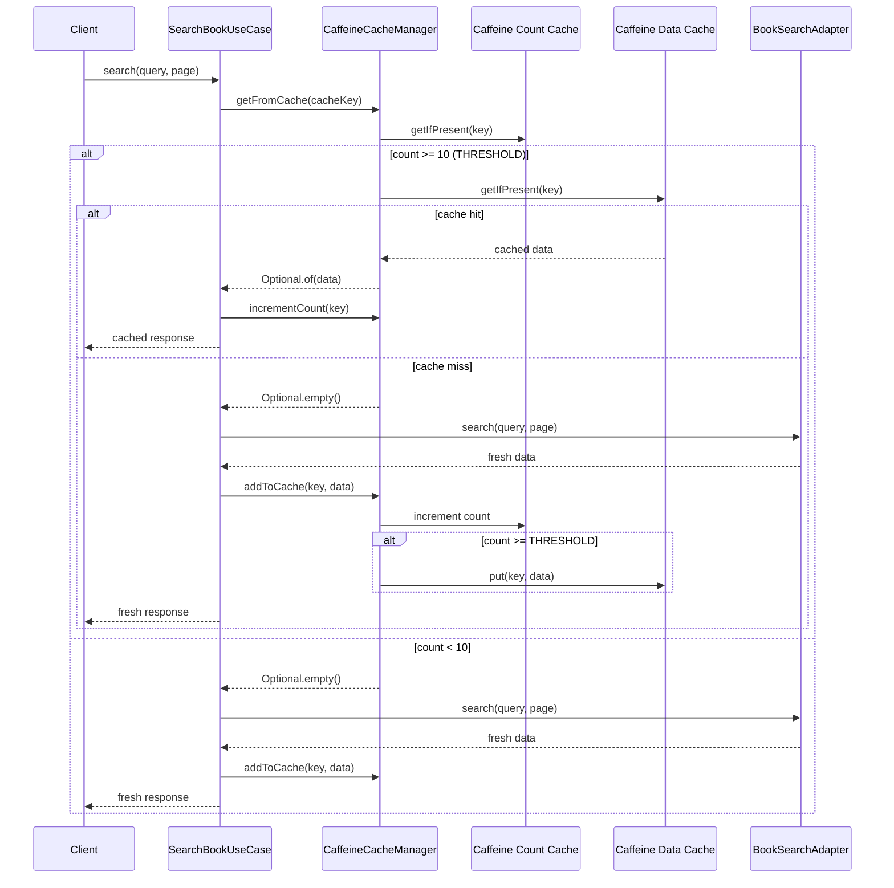
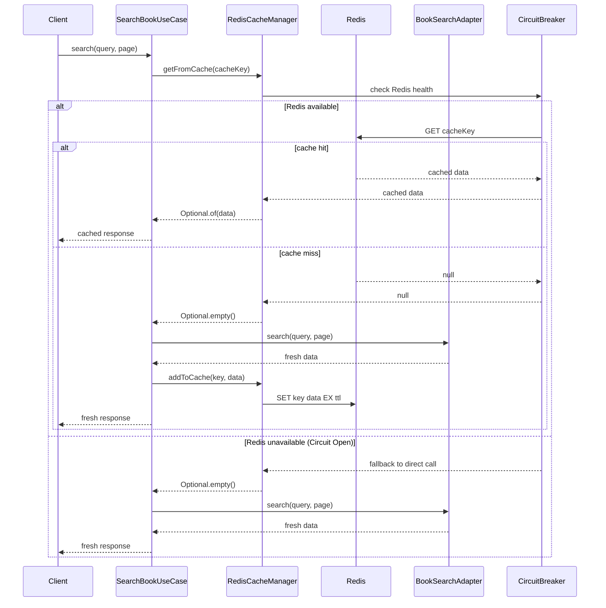

# 레디스 캐시

현재 구조에서는 카페인 캐시를 사용하여 자주 조회되는 책 검색 결과에 대해서 캐싱하고 있는 구조이다.

하지만, 카페인 캐시의 경우 로컬 캐시로써 JVM 내부의 메모리 영역을 사용하고 있으며, 스케일 아웃이 필요한 상황에서 적절하게 대응하기 어렵다.

이러한 이유로 네트워크 캐시(글로벌 캐시)인 레디스를 활용해서 캐시의 구조를 개선해보고자 한다.

## 현재 카페인 캐시 구조



## 레디스 캐시를 사용했을 때의 장점

- 레디스는 네트워크 캐시로써 여러 서버에서 공유할 수 있는 캐시이다.
- JVM의 메모리 영역이 아닌 별도의 서버에서 관리되므로, 스케일 아웃이 용이하다.

## 개선된 레디스 캐시 구조 (제안)



## 레디스 캐시를 사용했을 때 처리해야할 것들

이 부분이 핵심이라고 생각이 된다. 단순하게 레디스를 사용해서 위의 장점을 취할 수 있지만, 적절하게 예외처리를 하지 않는다면 오히려 문제가 더 커질 수 있다.

### 1. 장애 처리 (애플리케이션 레벨, Fallback)

#### 1.1 기본적인 try-catch 방식의 문제점

```java
try {
    return redisTemplate.opsForValue().get(key);
} catch (Exception e) {
    // 원본 데이터 소스에서 조회
    return repository.findById(key);
}
```

**문제점:**
- Redis 장애 시에도 매번 Redis에 요청을 시도
- 불필요한 네트워크 오버헤드 발생
- 응답 시간 지연
- 시스템 리소스 낭비

#### 1.2 Circuit Breaker 패턴 도입

**서킷 브레이커의 3가지 상태:**
- **CLOSED**: 정상 상태, Redis 요청 허용
- **OPEN**: 장애 상태, Redis 요청 차단, 즉시 fallback 실행
- **HALF-OPEN**: 복구 확인 상태, 제한적 요청 허용

**장점:**
- 장애 감지 후 즉시 fallback으로 전환
- 불필요한 요청 차단으로 성능 향상
- 자동 복구 감지 및 상태 전환
- 시스템 전체 안정성 향상

### 2. 장애 대응 (인프라 레벨, Failover)

#### 2.1 Stand-Alone의 문제점

**SPOF(Single Point of Failure)**
- 마스터 1대가 모든 읽기/쓰기 담당
- 서버 장애 시 전체 캐시 시스템 마비
- 수동 복구 필요

#### 2.2 Master-Slave 구조

- Master: 쓰기 담당
- Slave: 읽기 담당 (복제본, readonly)

**장점:**
- 읽기/쓰기 부하 분산
- 장애 발생 빈도 감소
- 읽기 성능 향상

**문제점 및 한계:**
- Master 장애 시 쓰기 불가능 (살아있는 Slave를 통해 읽기만 가능)
- 수동 Slave → Master 승격 필요, 개발자가 직접 대응

#### 2.3 Redis Sentinel을 통한 고가용성

1. **모니터링**: Master/Slave 상태 지속 감시
2. **알림**: 장애 발생 시 개발자에게 통지
3. **자동 Fail-over**: 정족수 기반 투표로 새로운 Master 선출
4. **서비스 디스커버리**: 클라이언트에게 현재 Master 정보 제공

**Failover 프로세스:**
1. Sentinel들이 Master 장애 감지
2. 정족수(Quorum) 기반 투표 실시
3. 적합한 Slave를 새로운 Master로 승격
4. 다른 Slave들을 새로운 Master로 재구성
5. 클라이언트에게 새로운 Master 정보 전달

### 3. 대규모 트래픽 상황에서의 고려사항

#### 3.1 캐시 스탬피드(Cache Stampede) 방지

**문제상황:**
- 인기 있는 데이터의 캐시가 만료되는 순간
- 수많은 요청이 동시에 DB로 몰림
- DB 부하 급증으로 시스템 장애 가능성

**해결방안: Single Flight Pattern**
```java
// 동일한 키에 대해 하나의 요청만 실제 데이터를 가져오고
// 나머지는 그 결과를 대기하여 공유
```

#### 3.2 PER (Probabilistic Early Recomputation) 알고리즘

**개념:**
- 캐시 만료 전에 확률적으로 미리 갱신
- 만료 시점에 모든 요청이 몰리는 것을 방지
- 부드러운 캐시 갱신으로 성능 안정화

#### 3.3 분산 락(Distributed Lock)

**목적:**
- 캐시 갱신 시 여러 인스턴스 간 경합 방지
- 데이터 일관성 보장
- 중복 연산 방지

### 4. 모니터링 및 알림 체계

#### 4.1 핵심 메트릭

- **캐시 히트율**: 캐시 효율성 측정
- **서킷브레이커 상태**: 장애 상황 감지
- **응답 시간**: 성능 모니터링
- **에러율**: 시스템 안정성 확인

#### 4.2 알림 설정

- Sentinel 이벤트 감지
- Master 전환 알림
- Circuit Breaker 상태 변경 알림
- 성능 메트릭 임계값 초과 알림

### 5. 다층 방어 전략

```
Client Request
     ↓
Circuit Breaker (Fallback)
     ↓
Redis Sentinel (Fail-over)
     ↓
Master-Slave Cluster
     ↓
Database (Final Fallback)
```

이러한 전략들을 통해 Redis 장애 상황에서도 서비스 중단 없이 안정적인 캐시 시스템을 운영할 수 있습니다.
